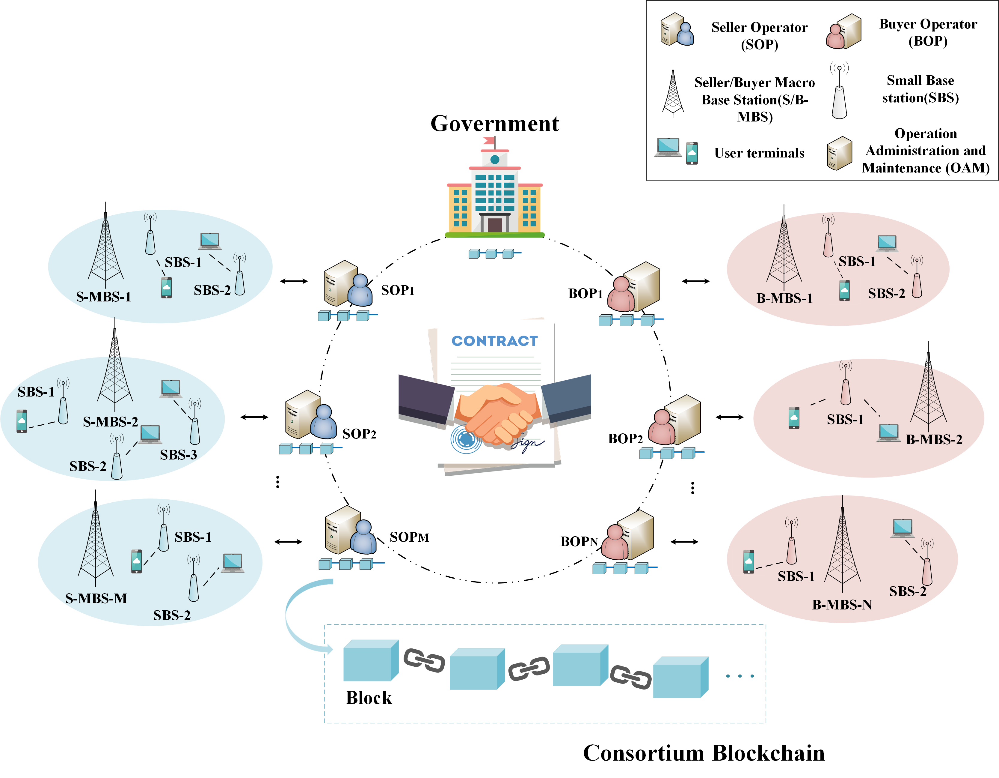

# Smart Contract-based Secure Spectrum Sharing in Multi-Operators Wireless Communication Networks
## The system model
Dynamic spectrum sharing is a promising way to solve the spectrum underutilization of multi-operators. Underloaded operators(OP) who may have the idle spectrum can join the seller OPs group and share their idle spectrum with a certain price. As a consequence, the revenue and spectrum utilization of underloaded OPs can be improved. Overloaded Ops, whose licensed spectrum is unable to meet needs of all users, can join the buyer OPs group to purchase the spectrum from the seller OPs group. With the spectrum purchased from seller OPs, the quality of service of users served by overloaded OPs can be improved.
We design a Multi-OPs Spectrum Sharing (MOSS) smart contract on the consortium blockchain for spectrum sharing in wireless communication networks. Without a trustless spectrum broker, different OPs can autonomously trade the spectrum by calling functions defined in the MOSS smart contract. 

## How to implement the MOSS?
You can test our MOSS smart contract using Remix IDE. Go to [RemixIDE](https://remix.ethereum.org "RemixIDE") and upload our code file moss.sol.
## Function introduction
##### 1. The government deploys the smart contract
In Remix-IDE select the account of government and click on *Deploy*.
##### 2. OPs submit the bid:
Call the function BidOrAskSubmit() from account of OPs with the following arguments:
